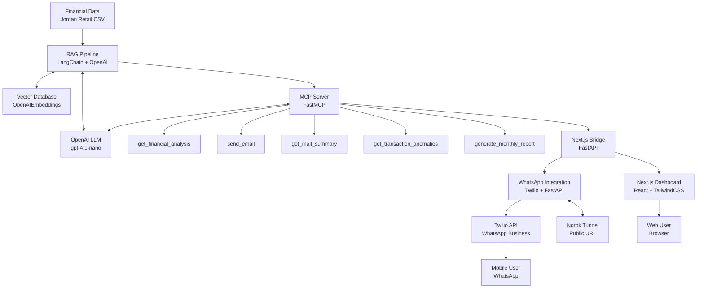
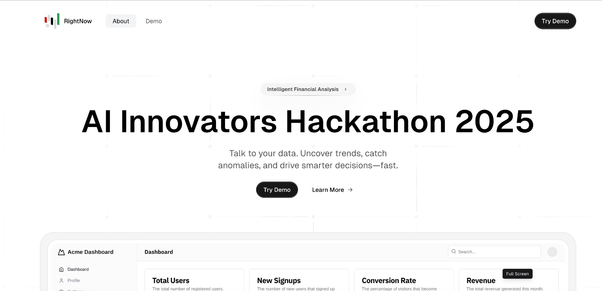
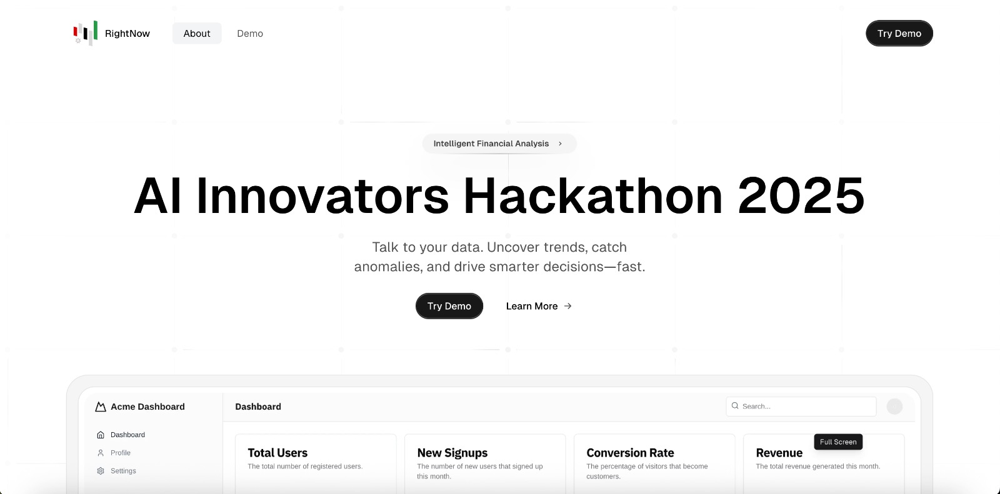
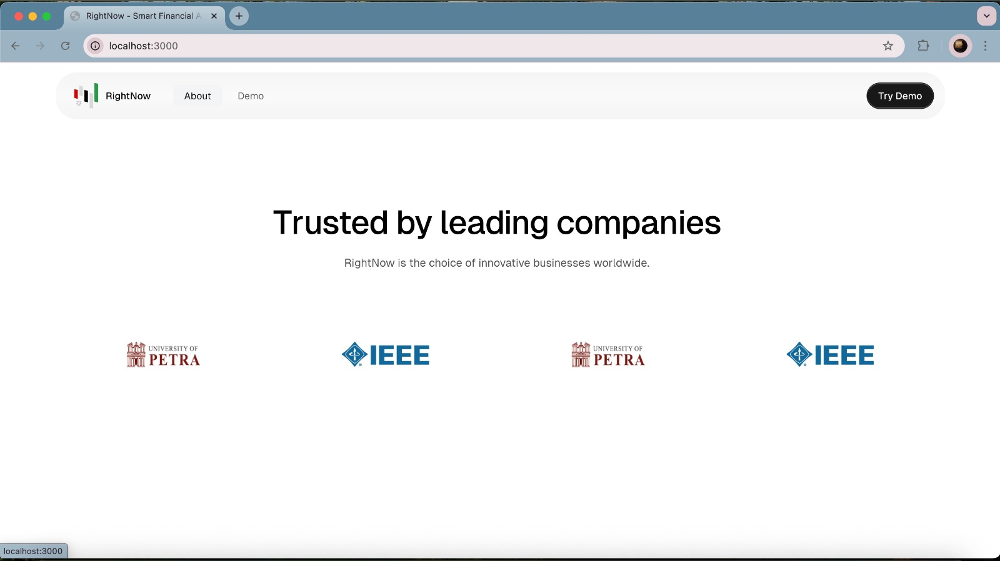
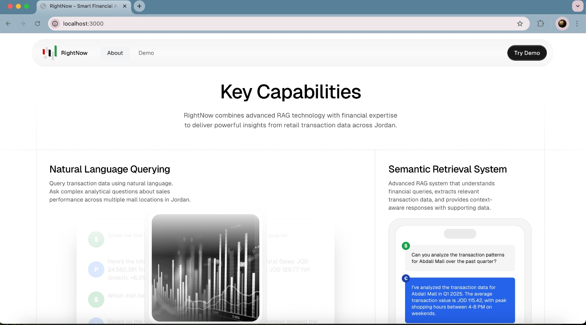
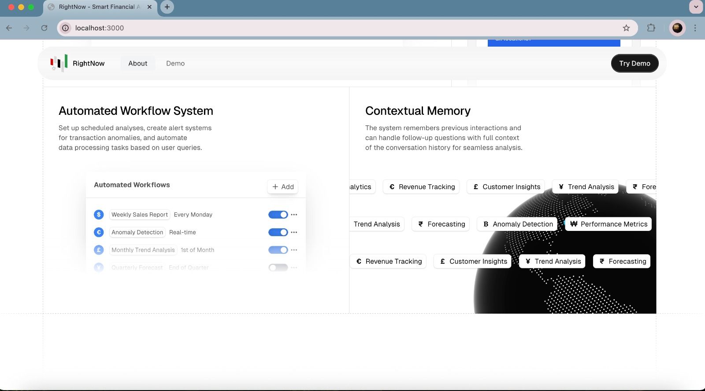
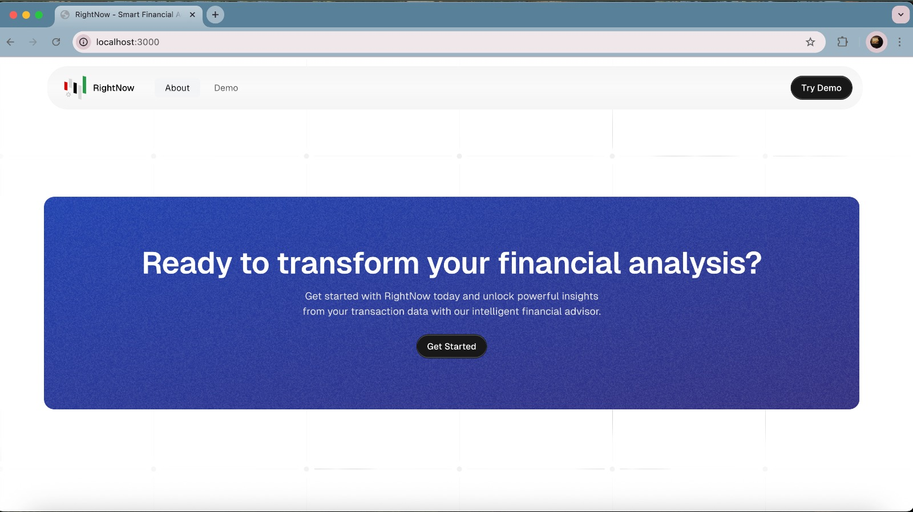

# RightNow Financial Advisor

[](https://github.com/yourusername/financial-advisor)
[](https://github.com/yourusername/financial-advisor)
[](https://github.com/yourusername/financial-advisor)
[](https://github.com/yourusername/financial-advisor)

> A multi-platform financial analytics AI system built for the AI Innovators Hackathon 2025. Interact with financial data through a modern Next.js dashboard or WhatsApp messaging.

## Demo

**Online Demo**: [Watch on Canva](https://www.canva.com/design/DAGnEk7eOaY/EkgBMZjM8fTSfMLbjfrlfA/watch?utm_content=DAGnEk7eOaY&utm_campaign=share_your_design&utm_medium=link2&utm_source=shareyourdesignpanel)

**Local Demo**: [Download demo.mp4](images/demo.mp4) _(Note: Requires Git LFS to download)_


## Project Architecture

Our project implements a comprehensive financial analytics system using a multi-tier architecture:

1. **Core AI Engine**: RAG-based pipeline powered by OpenAI LLMs
2. **MCP Orchestration Layer**: Function calling and tool orchestration 
3. **API Bridge**: Connection between MCP and frontend systems
4. **User Interfaces**: Next.js web dashboard and WhatsApp integration


## System Flow Diagram



### Detailed Technology Stack

1. **Data Sources & Processing**
   - **Jordan Retail Transaction Data**: CSV format, containing mall financial data
   - **PDFPlumberLoader**: For parsing financial PDF documents
   - **RecursiveCharacterTextSplitter**: For optimal document chunking
   - **OpenAI Embeddings**: Vector embeddings for similarity search
   - **In-memory Vector Database**: For efficient context retrieval
   - **Cosine Similarity**: For finding relevant document sections

2. **Core AI Components**
   - **LangChain Framework**: For RAG implementation in `rag_pipeline.py`
   - **OpenAI LLM**: Using gpt-4.1-nano model for responses
   - **Custom Prompt Templates**: For financial domain-specific queries
   - **FastMCP Framework**: For tool registration and orchestration

3. **MCP Tool Registry** (Exact function names)
   - `get_financial_analysis`: Retrieves financial insights from transaction data
   - `send_email`: Sends reports and notifications via email
   - `get_mall_summary`: Generates transaction summaries across all malls
   - `get_transaction_anomalies`: Detects unusual patterns in financial data
   - `generate_monthly_report`: Creates monthly financial performance reports

4. **Bridge & Frontend**
   - **FastAPI**: Powers the Next.js Bridge in `next_mcp_server.py`
   - **React**: Frontend framework for the dashboard
   - **TailwindCSS**: For responsive UI styling
   - **Framer Motion**: For smooth animations
   - **Chart.js**: For data visualization components

5. **WhatsApp Integration**
   - **Twilio API**: For WhatsApp Business integration
   - **Command Processor**: Parses commands like `/financial`, `/summary`
   - **ngrok**: Creates public tunnels for webhook accessibility
   - **WhatsApp Sandbox**: For development and testing

6. **Deployment**
   - **start_servers.bat**: Unified startup script for all components
   - **Environment Configuration**: Via .env files
   - **Multiple Port Configuration**: 8000, 8001, 8002, 3000

## Key Technologies

- **RAG Pipeline**: LangChain + OpenAI for context-aware financial analysis
- **MCP Function Calling**: Tool orchestration for seamless AI integration
- **Next.js Dashboard**: Modern, responsive frontend with real-time data visualization
- **WhatsApp Integration**: Twilio API for mobile conversational interactions
- **Python Backend**: FastAPI for high-performance API endpoints
- **Document Processing**: PDF parsing and vector embeddings for financial document analysis

## Core Components

### 1. MCP Server (`mcp_server.py`)

The MCP (Model Control Protocol) server acts as our AI orchestration hub, providing a unified interface for all AI tools and functions.

```python
# Function registration with MCP
@mcp.tool()
def get_financial_analysis(question: str) -> str:
    """Query the Jordan retail transaction data and provide financial analysis"""
    return ask_from_csv(question)
```

The MCP server:
- Registers tools for financial analysis, email communication, and reporting
- Provides a standardized function calling interface for the LLM
- Enables real-time monitoring of AI tool execution
- Acts as the central nervous system of our application

### 2. RAG Pipeline (`rag_pipeline.py`)

Our Retrieval-Augmented Generation pipeline:

- **Data Ingestion**: Parses financial data from CSV sources
- **Vector Embeddings**: Creates searchable embeddings using OpenAI's models
- **Intelligent Chunking**: Splits data into optimal retrieval units
- **Contextual Retrieval**: Uses cosine similarity to find relevant information
- **LLM Integration**: Formulates and sends prompts to gpt-4.1-nano with context

This enables the system to provide detailed, data-backed financial insights beyond what a standard LLM could achieve alone.

### 3. Next.js Bridge (`next_mcp_server.py`)

The bridge server connects our Next.js frontend to the MCP ecosystem:

```python
@app.post("/call_tool")
async def call_tool(request: Request):
    # Secure proxy to MCP tools from the Next.js frontend
    data = await request.json()
    result = await session.call_tool(data.get("tool_name"), arguments=data.get("arguments", {}))
    return {"result": result.content[0].text}
```

- Implements a REST API for Next.js to access MCP tools
- Handles connection management and retries
- Provides authentication and session handling
- Transforms data between frontend and MCP formats

### 4. Next.js Dashboard

Our frontend offers:

- **Real-time Data Visualization**: Charts, graphs, and dynamic tables
- **Conversational Interface**: Chat with the financial AI system
- **Integration Management**: Configure WhatsApp and other extensions
- **Export Capabilities**: Generate PDFs and JSON exports of financial insights
- **Responsive Design**: Optimized for desktop and mobile usage

## Frontend Landing Page Design

Below are screenshots of our planned landing page design that wasn't deployed due to time constraints:

| | |
|---|---|
|  |  |
|  |  |
|  |  |

### 5. WhatsApp Integration (`whatsapp_integration.py`)

Connect to the system via WhatsApp:

```python
@app.post("/webhook")
async def whatsapp_webhook(request: Request):
    # Process incoming WhatsApp messages
    form_data = await request.form()
    message_body = form_data.get("Body", "")
    response_text = process_user_message(message_body)
    twiml = MessagingResponse()
    twiml.message(response_text)
    return Response(content=str(twiml), media_type="application/xml")
```

- **Twilio API Integration**: Securely connect to WhatsApp Business API
- **Command Processing**: Parse and route user commands to MCP tools
- **Public Accessibility**: ngrok tunneling for local development
- **Response Formatting**: Optimize AI outputs for mobile messaging

## Setup and Installation

### Prerequisites
- Python 3.8+ (with pip)
- Node.js 16+ (with npm)
- OpenAI API key
- Twilio account (for WhatsApp integration)

### Installation Steps

1. Clone the repository:
   ```bash
   git clone https://github.com/yourusername/financial-advisor.git
   cd financial-advisor
   ```

2. Install Python dependencies:
   ```bash
   pip install -r requirements.txt
   ```

3. Set up environment variables:
   ```bash
   cp .env-template .env
   # Edit .env with your API keys
   ```

4. Install Next.js dependencies:
   ```bash
   cd financial-advisor-nextjs
   npm install
   cd ..
   ```

5. Start all servers:
   ```bash
   start_servers.bat  # Windows
   # OR
   ./start_servers.sh  # Linux/Mac
   ```

### WhatsApp Integration Setup

For WhatsApp connectivity, run:
```bash
python run_whatsapp_with_tunnel.py
```

This will:
1. Start the WhatsApp integration server
2. Create a public ngrok tunnel
3. Provide the webhook URL to configure in Twilio

## Features and Use Cases

### Financial Analysis
- Real-time mall transaction analytics
- Customer segmentation and behavior insights
- Revenue forecasting and trend analysis
- Anomaly detection in financial patterns

### Multi-Platform Access
- **Web Dashboard**: Full-featured analytics experience
- **WhatsApp**: On-the-go access to financial insights
- **API Endpoints**: Integration with existing systems

### User Commands
The AI responds to these commands via WhatsApp:
- `/financial [question]` - Ask about financial data
- `/summary` - Get a mall transaction overview
- `/anomalies` - Find unusual transaction patterns
- `/report [month]` - Generate monthly financial report
- `/help` - View available commands

## Team and Acknowledgments

This project was developed for the **AI Innovators Hackathon 2025** by team **RightNow**:

- **Jaber Jaber** - AI Developer (RAG Implementation & MCP Integration)
- **Osama Jaber** - Web Designer (Next.js Dashboard & Frontend)

## License

This project is licensed under the MIT License - see the [LICENSE](LICENSE) file for details.

---

*Built for the AI Innovators Hackathon 2025 by Team RightNow*
